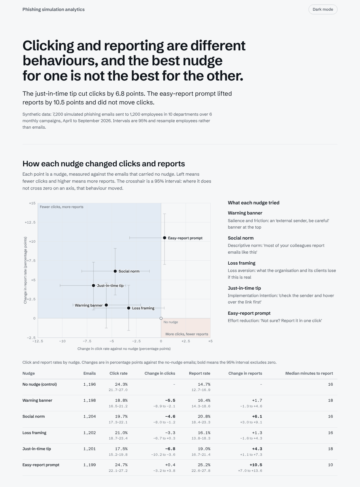
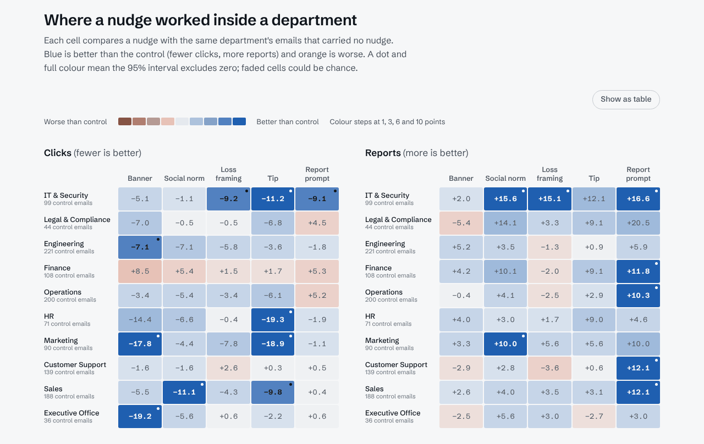

# phishing-sim-dashboard

Click and report rates from phishing simulations, by nudge type and department, using synthetic data, with a short behavioural reading of the results.

**[Open the dashboard](https://muhammadmurtuzahussain.github.io/phishing-sim-dashboard/)** · [Behavioural reading](docs/behavioural-reading.md) · [Data dictionary](docs/data-dictionary.md)

[](https://muhammadmurtuzahussain.github.io/phishing-sim-dashboard/)

A phishing simulation asks two different questions. The click rate says how exposed individuals are. The report rate says whether the organisation is acting as a sensor. A nudge can move one without the other, so this project reads the two together, by nudge type and by department.

## What the data says

The just-in-time tip cut clicks by 6.8 points. The easy-report prompt lifted reports by 10.5 points and did not move clicks. The social norm and the tip did both, the warning banner mainly cut clicks, and loss framing did neither beyond chance.

Departments differ more in reporting than in clicking: IT & Security reports 48% of the time, Sales 11%. At department level most nudge effects are leads rather than findings, because each cell holds only 35 to 220 emails. The [behavioural reading](docs/behavioural-reading.md) sets this out, with what to test next and what the data cannot show.

These effects are assumptions written into the generator. The dashboard recovers them, which shows how to read this kind of result, not that any nudge works in practice.

## Start here

The loop is: generate the data, look at the rates, run the checks, build the page.

```bash
git clone https://github.com/MuhammadMurtuzaHussain/phishing-sim-dashboard.git
cd phishing-sim-dashboard
python3 -m venv .venv && source .venv/bin/activate
pip install -r requirements-dev.txt

python -m psim.generate    # writes data/phishing_sim_events.csv and data/assumptions.json
python -m psim.summary     # click and report rates by nudge, department and campaign
python -m pytest -q        # structure, randomisation, effects, statistics, page, drift
python -m psim.build       # writes site/index.html and docs/behavioural-reading.md
make serve                 # builds, then serves the page at http://localhost:8000
```

```
7,200 simulation emails, overall click 21.0%, report 18.7%

By nudge type
                       n click_% report_% median_min_to_report
none               1,196    24.3     14.7                   16
warning_banner     1,198    18.8     16.4                   18
social_norm        1,204    19.7     20.8                   16
loss_framing       1,202    21.0     16.1                   16
just_in_time_tip   1,201    17.5     19.0                   18
easy_report_prompt 1,199    24.7     25.2                   10
```

## The dashboard

One self-contained HTML file: the font, styles, script and data are inlined, so it opens from disk and makes no network requests. It has five parts.

- **Nudges.** Change in click rate against change in report rate for each nudge, against the emails that carried no nudge, with 95% intervals and a table beside it.
- **Departments.** Click rate against report rate for each department, with the organisation-wide rates marked.
- **Department by nudge.** Two heatmaps, one for clicks and one for reports, comparing each nudge with the same department's no-nudge emails. A dot and full colour mean the interval excludes zero; faded cells could be chance.
- **Campaigns.** Click and report rates over the six monthly campaigns, with the lure for each.
- **Reading.** What the pattern suggests, in plain language, with the method and caveats.



Design choices worth knowing about:

- **Orange is the risky direction and blue the protective one, in every chart.** A click rate that falls and a report rate that rises are both blue, so the colour never changes meaning between panels. It works for the common forms of colour blindness, and every figure has a table view.
- **Intervals resample employees, not emails.** The same person appears in up to six campaigns, so treating emails as independent would make every interval too tight. A nudge and its control share each resample, so an interval on a difference allows for the overlap.
- **The text is checked against the data.** The headline and the reading are generated from the statistics, and `psim/build.py` asserts every claim in them before it writes the file. If the data changes so that a sentence is no longer true, the build fails instead of publishing it.
- **It reads without scripts.** The headline, the reading and every table are plain HTML. The script only draws the charts and the tooltips.

## The data

One row per employee per monthly campaign: 1,200 employees in ten departments, six campaigns from April to September 2026, 7,200 rows. Each email carries one of six nudge types (no nudge as the control, warning banner, social norm, loss framing, just-in-time tip, easy-report prompt), and the outcome is whether the employee clicked, reported, both or neither, with the time taken.

Three design choices:

- **Randomised and balanced.** Within each department, every campaign deals the nudges out evenly to a shuffled list of employees, so a comparison between nudge types is fair by design.
- **Click and report are modelled separately.** The warning banner is built to cut clicks more than it lifts reports, and the easy-report prompt the other way round. Whether the dashboard makes that visible is part of the test.
- **Every assumption is written down.** Baselines, effect sizes and department differences live in [`psim/config.py`](psim/config.py) and are exported to `data/assumptions.json`. Column definitions and how to compute the rates are in the [data dictionary](docs/data-dictionary.md).

## Limits to keep in mind

- **The data is synthetic.** Effect sizes are assumptions with plausible direction, not findings. A dashboard can only recover what the generator put in, so nothing here shows that any nudge works in practice.
- **Small cells.** A department-by-nudge cell holds about 35 to 220 rows. In the generated data the Finance banner cell shows more clicks than the Finance control, although the generator gives the banner lower click odds. That is sampling noise, and the reason the dashboard shows row counts and intervals. With 100 cell comparisons, a handful would clear the 95% bar by chance alone.
- **Habituation is built in but faint.** Each person sees a given nudge about once across six campaigns, so the fade-out of repeated nudges is too small to see at this sample size.
- **A click is not a compromise, and a report is not a correct judgement.** The reading says what each measure can and cannot support.

## If you point this at real data

Employee-level click and report data is personal data under GDPR, and simulation results can feel punitive. Agree the purpose, retention and who sees what with HR and data protection before using it, report at department level only above a minimum group size (ten, for example), and keep individual results out of disciplinary processes. A programme like this supports, but does not satisfy, the awareness and training expectations in ISO/IEC 27001:2022 Annex A 6.3 and NIS2 Article 21(2)(g).

To use your own export, produce a CSV with the columns in the [data dictionary](docs/data-dictionary.md) and run `python -m psim.build --csv path/to/file.csv`. The text checks are written for this dataset, so expect to rewrite the reading for yours.

## Layout

```
psim/config.py        every assumption behind the data
psim/generate.py      seeded generator and CSV writer
psim/summary.py       rates by nudge, department and campaign
psim/analysis.py      rates, differences and employee-level bootstrap intervals
psim/build.py         builds the page and the reading, and checks the text against the data
psim/docs.py          renders the data dictionary from the code
psim/web/             page template, styles, script and the embedded font
data/                 phishing_sim_events.csv and assumptions.json (seed 2026)
docs/                 data-dictionary.md and behavioural-reading.md (both generated), screenshots
tests/                data, statistics and page checks, plus drift checks on committed files
.github/workflows/    lint, tests, build and deploy to GitHub Pages
```

## Roadmap

1. Dataset: done.
2. Dashboard: done.
3. Behavioural reading: done.

Possible next steps: a combined-nudge arm to test whether the tip and the report prompt add up, repeat exposure long enough to show habituation, and a time-to-report view.

Code is MIT licensed. The embedded font, Schibsted Grotesk, is under the SIL Open Font License; the licence text is in `psim/web/fonts/`.
